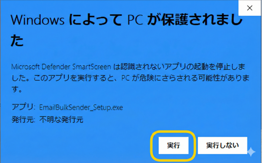

# メール一括送信ツール

CSVやExcelのリストに基づいた個別対応のメールを一斉送信するツールです。CLI版とGUI版の両方を提供しています。

## 目次

- [機能](#機能)
- [ツールの種類](#ツールの種類)
- [必要な環境](#必要な環境)
- [セットアップ](#セットアップ)
- [ファイルの準備](#ファイルの準備)
- [使い方（CLI版）](#使い方cli版)
- [使い方（GUI版）](#使い方gui版)
- [インストーラーの作成](#インストーラーの作成)
- [主要メールサービスのSMTP設定](#主要メールサービスのsmtp設定)
- [トラブルシューティング](#トラブルシューティング)
- [よくある質問](#よくある質問)
- [ベストプラクティス](#ベストプラクティス)
- [注意事項](#注意事項)
- [ライセンス](#ライセンス)
- [サポート](#サポート)

## 機能

- **CSVおよびExcelファイル（.xlsx）対応** - 受信者リスト（所属、氏名、メールアドレス）を読み込み
- **文字コード自動検出** - UTF-8、Shift_JIS、EUC-JPなどを自動判別
- **改行コードの自動処理** - Windows（CR+LF）/Unix（LF）/Mac間でのファイル交換に対応
- テンプレート内の `{所属}` と `{氏名}` を各受信者の情報に自動置換
- 件名と本文を1つのテンプレートファイルで管理
- CC、BCC、Reply-To の設定に対応
- ファイルの添付に対応
- 任意のSMTPサーバーに対応（Gmail、Outlook、独自メールサーバーなど）
- SSL/TLS 両方に対応（ポート番号で自動判別）
- 送信間隔の設定（スパム対策）
- 日本語・英語の多言語対応
- 設定ファイルによる保存・読み込み

## ツールの種類

| 種類 | ファイル | 説明 |
|------|----------|------|
| CLI版 | `email_bulk_sender.py` | コマンドライン版。対話形式またはオプション指定で実行 |
| GUI版 | `email_bulk_sender_gui.py` | GUIアプリケーション版。Windows/macOSインストーラーにも対応 |

### GUI版の追加機能

- 送信前プレビュー（1件目のデータでメール内容を確認）
- 受信者リスト一覧表示
- テスト送信（指定アドレスに1通だけ送信）
- 送信進捗バーとリアルタイムログ
- 送信中のキャンセル機能
- パスワードの安全な保存（Windows: Credential Store / macOS: Keychain）
- GUI上での日本語・英語切り替え

## 必要な環境

- Python 3.6以上
- インターネット接続

### 必要なPythonライブラリ

#### CLI版

基本機能は標準ライブラリのみで動作します。追加機能を使う場合：

```bash
pip install chardet     # 文字コード自動検出
pip install openpyxl    # Excelファイル対応（オプション）
```

#### GUI版

```bash
pip install -r requirements.txt
```

`requirements.txt` には以下が含まれます：
- `customtkinter` - モダンなGUIフレームワーク
- `chardet` - 文字コード自動検出
- `openpyxl` - Excelファイル対応
- `keyring` - パスワードの安全な保存

## セットアップ

### 1. リポジトリのクローン

```bash
git clone https://github.com/kytk/email-bulk-sender.git
cd email-bulk-sender
```

### 2. ファイル構成

```
email-bulk-sender/
├── email_bulk_sender.py      # CLI版
├── email_bulk_sender_gui.py  # GUI版
├── requirements.txt          # 依存パッケージ
├── installer/
│   ├── setup.iss             # Inno Setup スクリプト（Windows用）
│   ├── build_win.bat         # Windows ビルドスクリプト
│   └── build_mac.sh          # macOS ビルドスクリプト
├── examples/                 # サンプルファイル
│   ├── list_sample.csv
│   ├── list_sample.xlsx
│   ├── body_sample.txt
│   ├── body_sample_win.txt
│   └── body_en_sample.txt
├── LICENSE
└── README.md
```

## ファイルの準備

`examples/` ディレクトリにサンプルファイルが用意されています。

**サンプルファイルのコピー：**

```bash
# Unix/Mac/Linux
cp examples/list_sample.csv list.csv
cp examples/body_sample.txt body.txt

# Windows
copy examples\list_sample.csv list.csv
copy examples\body_sample_win.txt body.txt
```

### 受信者リスト（list.csv / list.xlsx）

#### CSVファイル形式

```csv
所属,氏名,メールアドレス
株式会社ABC,山田太郎,yamada@example.com
XYZ商事株式会社,佐藤花子,sato@example.com
テクノロジー株式会社,鈴木一郎,suzuki@example.com
```

**注意点：**
- 1行目は必ずヘッダー行（`所属,氏名,メールアドレス`）
- 文字コードは UTF-8 推奨（Shift_JIS等も自動検出されます）
- 英語ヘッダー（`affiliation,name,email`）も使用可能

#### Excelファイル形式（list.xlsx）

| 所属 | 氏名 | メールアドレス |
|------|------|----------------|
| 株式会社ABC | 山田太郎 | yamada@example.com |
| XYZ商事株式会社 | 佐藤花子 | sato@example.com |

- Excelで直接編集・保存が可能（CSV変換不要）
- 文字コードや改行コードの問題が発生しない
- `openpyxl` ライブラリが必要

### メールテンプレート（body.txt）

```
ご案内 - {所属} {氏名}様

{所属}
{氏名}様

いつもお世話になっております。
（本文をここに記載します）
```

**ルール：**
- **1行目**: 件名（`{所属}` で所属名、`{氏名}` で氏名を自動置換）
- **2行目**: 空行（必須）
- **3行目以降**: 本文（同じプレースホルダーが使用可能）

`examples/body_sample.txt` にプレースホルダーの使い方を説明したサンプルがあります。

## 使い方（CLI版）

### 基本的な実行

```bash
# 日本語で実行（デフォルト、システム言語を自動検出）
python email_bulk_sender.py

# 英語で実行
python email_bulk_sender.py --lang en
```

### 設定ファイルの利用

```bash
# 設定をファイルに保存して実行
python email_bulk_sender.py --save-config

# 保存した設定を読み込んで実行
python email_bulk_sender.py --load-config
```

設定ファイルは `~/.email_bulk_sender/config.json` に保存されます。

### 実行例

```
=== メール一括送信ツール ===

SMTPサーバー (例: smtp.gmail.com): smtp.gmail.com
SMTPポート (デフォルト: 587): 587
送信元メールアドレス: your.email@gmail.com
メールパスワード: ********
送信元表示名 (不要ならEnter): 株式会社サンプル 営業部
受信者リストCSVファイル (デフォルト: list.csv):
メールテンプレートファイル (デフォルト: body.txt):
CC (複数の場合はカンマ区切り、不要ならEnter):
BCC (複数の場合はカンマ区切り、不要ならEnter):
Reply-To (不要ならEnter):
```

## 使い方（GUI版）

### Pythonから起動

```bash
pip install -r requirements.txt
python email_bulk_sender_gui.py
```

### 画面構成

GUI版は以下のセクションで構成されています：

1. **SMTP設定** - SMTPサーバーとポート番号
2. **送信元設定** - メールアドレス、パスワード、表示名
3. **ファイル設定** - 受信者リスト、テンプレート、添付ファイル（参照ボタンで選択可能）
4. **メールオプション** - CC、BCC、Reply-To、送信間隔
5. **操作ボタン** - 受信者リスト確認、プレビュー、テスト送信、送信開始
6. **送信ログ** - 進捗バーとリアルタイムログ

### 設定の保存

- 「設定を保存」ボタンでSMTPサーバー、メールアドレス等の設定をJSONファイルに保存
- パスワードは `keyring`（Windows: Credential Store / macOS: Keychain）に安全に保存
- 次回起動時に自動的に読み込まれます

### 言語切り替え

画面右上の「JA / EN」ボタンで日本語・英語を即時切り替えできます。

## インストーラーの作成

各OS用のビルドスクリプトが `installer/` ディレクトリに用意されています。

**前提条件（共通）：**

```bash
pip install -r requirements.txt
pip install pyinstaller
```

### Windows

[Inno Setup](https://jrsoftware.org/isdl.php) を事前にインストールしてください（インストール時に日本語の言語ファイルも選択してください）。

ビルドの実行：

```bash
installer\build_win.bat
```

以下が生成されます：
- `dist\EmailBulkSender\EmailBulkSender.exe` - 実行ファイル
- `installer\Output\EmailBulkSender_Setup.exe` - インストーラー
- `EmailBulkSender_win.zip` - 配布用ZIP（インストーラー + サンプルファイル + README.html）

**注意：** インストーラーやexeの実行時に「WindowsによってPCが保護されました」と表示される場合は、「詳細情報」をクリックし、「実行」ボタンを押してください。これはコード署名がないために表示される警告であり、ソフトウェアに問題があるわけではありません。




**インストーラーの機能：**
- デフォルトインストール先: `C:\Program Files\EmailBulkSender`
- スタートメニュー登録
- デスクトップショートカット（オプション）
- アンインストーラー付き
- 日本語・英語対応

**手動でビルドする場合：**

```bash
REM 1. PyInstaller で exe 化
pyinstaller --onedir --windowed --name EmailBulkSender --collect-data customtkinter email_bulk_sender_gui.py

REM 2. Inno Setup でインストーラー作成
iscc installer\setup.iss
```

### macOS

Homebrew の Python と `create-dmg` を事前にインストールしてください（システム Python は古い Tcl/Tk を含むため使用できません）。

```bash
brew install python python-tk create-dmg
```

ビルドの実行：

```bash
bash installer/build_mac.sh
```

実行した Mac のアーキテクチャを自動検出し、対応する配布用 ZIP を生成します。

| ビルド環境 | 生成されるファイル |
|------------|-------------------|
| Intel Mac | `EmailBulkSender_mac_intel.zip` |
| Apple Silicon Mac | `EmailBulkSender_mac_arm64.zip` |

各 ZIP には DMG（インストーラー）、サンプルファイル、README.html が含まれます。

Intel版と Apple Silicon版の両方を配布する場合は、それぞれの Mac でビルドしてください。

**手動でビルドする場合：**

```bash
# 1. PyInstaller で .app バンドルを作成
pyinstaller --onedir --windowed --name "メール一括送信ツール" --collect-data customtkinter email_bulk_sender_gui.py

# 2. DMG を作成（create-dmg を使用）
create-dmg --volname "メール一括送信ツール" --app-drop-link 400 200 EmailBulkSender.dmg "dist/メール一括送信ツール.app"
```

## 主要メールサービスのSMTP設定

| サービス | SMTPサーバー | ポート | セキュリティ |
|---------|-------------|-------|-------------|
| Gmail | smtp.gmail.com | 587 | TLS |
| Outlook/Office365 | smtp.office365.com | 587 | TLS |
| Yahoo Mail | smtp.mail.yahoo.com | 587 | TLS |
| iCloud | smtp.mail.me.com | 587 | TLS |

**注意：** Gmailを使用する場合は[アプリパスワード](https://support.google.com/accounts/answer/185833)の取得が必要です。

## トラブルシューティング

### 接続拒否エラー

```
ConnectionRefusedError: [Errno 111] Connection refused
```

- 正しいポート番号を確認（一般的には587または465）
- ファイアウォールがポートをブロックしていないか確認
- SMTPサーバーアドレスが正しいか確認

### SSL/TLSエラー

```
ssl.SSLError: [SSL: WRONG_VERSION_NUMBER]
```

- ポート465の場合はSSL、587の場合はTLSが自動的に使用されます
- ポート番号とサーバー設定の組み合わせを確認

### ASCIIエンコードエラー（Windows）

```
送信エラー: 'ascii' codec can't encode characters in position ...: ordinal not in range(128)
```

- Windowsのコンピュータ名が日本語の場合に発生することがあります（Ver.3.1で修正済み）
- 送信元表示名に日本語を使用している場合にも発生することがあります（Ver.3.1で修正済み）

### 文字化け

- テンプレートファイルの文字コードはUTF-8推奨
- Shift_JIS（Windows標準）も自動検出されます
- Excelファイル（.xlsx）を使用すれば文字コードの問題を回避できます

## よくある質問

### Q: HTMLメールを送信できますか？

A: 現在のバージョンはテキストメールのみ対応しています。

### Q: 添付ファイルを送れますか？

A: はい、CLI版・GUI版ともに対応しています。複数ファイルの添付も可能です。

### Q: 送信間隔を変更できますか？

A: GUI版では画面上で設定できます。CLI版では `--save-config` で設定ファイルに保存できます。デフォルトは5秒です。

### Q: プレースホルダーを追加できますか？

A: 現在は `{所属}` と `{氏名}` の2つが使用可能です。追加したい場合は、CSVに列を追加し、スクリプトの `create_message` メソッドを修正してください。

## ベストプラクティス

1. **テスト送信**: 本番前にGUI版のテスト送信機能で自分宛てに確認
2. **少数から開始**: 最初は5-10件程度で動作確認
3. **送信リストの確認**: GUI版の「受信者リスト確認」機能で内容を確認
4. **プレビュー確認**: GUI版の「プレビュー」機能で実際の送信内容を確認
5. **送信間隔**: 大量送信時は送信間隔を長めに設定（100通以上は10秒以上推奨）

## 注意事項

- 受信者の同意なく営業メールを送信しないでください
- 特定電子メール法を遵守してください
- オプトアウト（配信停止）の手段を提供してください
- 個人情報を適切に管理してください

## ライセンス

このプロジェクトはMITライセンスの下でライセンスされています。詳細は [LICENSE](LICENSE) ファイルを参照してください。

## サポート

問題や質問がある場合は、[Issue](https://github.com/kytk/email-bulk-sender/issues) を作成してください。

---

**作成日**: 2025年9月
**更新日**: 2026年2月
**バージョン**: 3.1（日本語コンピュータ名・日本語表示名・日本語添付ファイル名でのASCIIエンコードエラーを修正）
